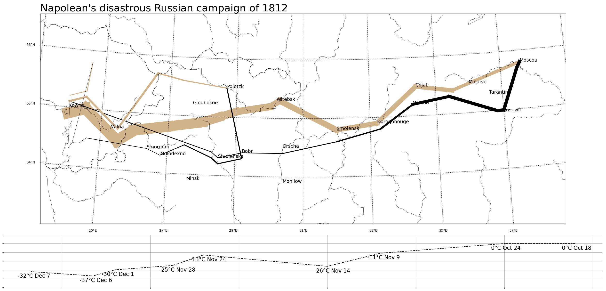

# Project 2: Napolean's disastrous Russian campaign of 1812

## Introduction

This project, "Napolean's disastrous Russian campaign of 1812" recreates the renowned [Charles Minard's Napoleon's disastrous Russian campaign of 1812](https://en.wikipedia.org/wiki/Charles_Joseph_Minard#/media/File:Minard.png) data visualization. We built the database using `pandas` and `sqlite3`, performed proof-of-concept validation with `matplotlib` and `basemap` finalized the product.

## How to Reproduce

- Install [Miniconda](https://docs.anaconda.com/miniconda)
- Build up environment according to `environment.yml` 

```shell
`conda env create -f environment.yml`
```

- Place the `minard.txt` from the `data/` folder into a `data/` directory in the working directory.
- Activate the environment and run `python create_minard_db.py`. This will create `minard.db` in the `data/` folder.
- Activate the environment and run `python plot_with_basemap.py`. This will create `minard_clone.png`.
